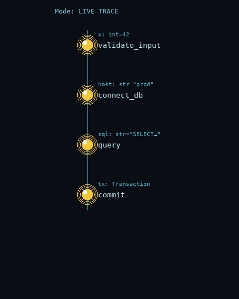
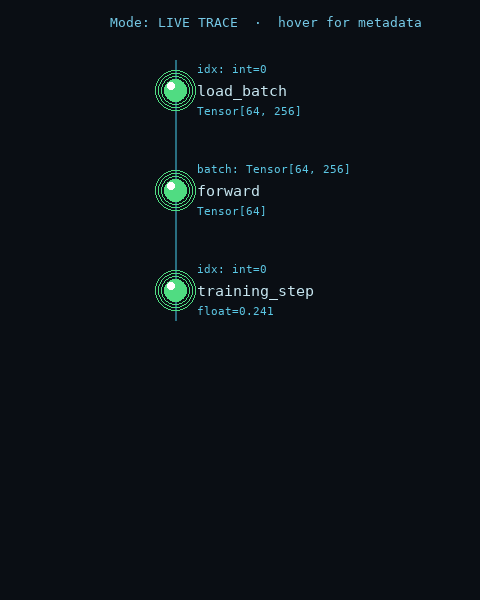
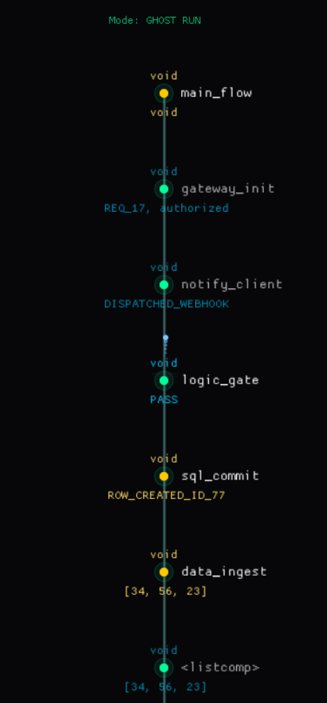

# DebugFlow — NeuralFlow Logic Engine

**A real-time execution tracer and Heads-Up Display for Python — see your functions fire as they happen, on a translucent "cybernetic spine" that lives on the side of your screen.**

Built for two audiences:

- **Developers** debugging Python scripts who want a non-intrusive, always-on visualisation of call flow, parameters, return values, and exceptions — no breakpoints, no `print()` statements.
- **AI / ML engineers** tracing data pipelines, model inference, and training loops, where seeing tensor shapes, sample sizes, and per-step timings live on screen beats reading log files after the fact.

---

## Quick Demo

```text
flow activate                  # Start the background sentinel
                               # press Ctrl+Alt+F to summon the HUD
                               # press Ctrl+Alt+S to fire your script
```

### What it looks like in flight

| Live call flow | Returns + exceptions | Hover for metadata |
|---|---|---|
|  |  |  |
| Each node pulses cyan as the function fires, sits **yellow** while running, then settles **green** on success. | Return pulses travel back **up** the spine. A function that raises flashes **red** and keeps its exception text. | Hovering a node dims the others and reveals the **module name** and **per-call duration** in the metadata overlay. |

> The HUD docks to the side of your screen and stays out of the way — translucent background, monospace labels, no title bar, click-through anywhere outside the spine. The GIFs above are rendered from the same palette and geometry the production HUD uses.

A real spine snapshot from a live ghost-pass run:



Nodes pulse cyan when called and travel back up to their parent on return. Hover any node to see its source module and timing. Click a node to jump straight to that line in your editor (VS Code, Cursor, Sublime, PyCharm — auto-detected).

> The demo GIFs are generated by `scripts/build_demo_gifs.py` (Pillow only, no GUI required) so you can rebuild them after any palette/animation tweak.

---

## Installation

Requires **Python 3.10+** on Windows, macOS, or Linux (with X11/Wayland for the global hotkey hooks).

```bash
# From the project root
pip install -e .
```

This installs the `debugflow` package and three console scripts: `flow`, `flow-logs`, `flow-logs-on`, `flow-logs-off`.

Dependencies (auto-installed):

| Package    | Why                                              |
| ---------- | ------------------------------------------------ |
| `dearpygui` | GPU-accelerated drawlist for the HUD canvas      |
| `pynput`    | Cross-platform global hotkeys (no root on Linux) |
| `psutil`    | PID lifecycle + zombie process cleanup           |

---

## Minimal Usage

### Option 1 — Hotkey-driven (recommended)

```bash
cd /path/to/your/project
flow activate           # Sentinel daemon starts in the background
```

You'll see the active hotkeys printed:

```
  ──────────────────────────────────────
  DebugFlow hotkeys active:
        Toggle HUD     : Ctrl + Alt + F
        Run / Trigger  : Ctrl + Alt + S
  ──────────────────────────────────────
```

Then:

1. Press **Ctrl+Alt+F** — the translucent HUD docks to the right edge of your screen.
2. Press **Ctrl+Alt+S** — DebugFlow auto-runs your most recently modified `.py` file and streams every call into the HUD.

### Option 2 — Programmatic (no daemon needed)

```python
from debugflow.flow_engine import launch

def my_function(x, y):
    return x + y

if __name__ == "__main__":
    launch("my_function", Ghost=True, Real_Time=True)
```

Run the script directly. As long as the HUD is open on port 5555, traces flow in.

### Stopping it

```bash
flow status      # See if the sentinel is alive
flow deactivate  # Kill the sentinel and the HUD
```

---

## Problem + Motivation

Traditional Python debugging falls into three categories, and each one breaks the flow of writing code:

1. **`print()` statements** — you delete them, you re-add them, they pollute output, they teach you nothing about timing or call order.
2. **Step debuggers (`pdb`, IDE breakpoints)** — they pause execution, which is useless for any code that depends on real-time behaviour: ML training loops, async pipelines, sensor streams, anything with timing.
3. **Log scraping** — you write logs, run the script, scroll a 5000-line log trying to reconstruct what happened. By the time you understand the flow, you've forgotten the bug.

DebugFlow solves a fourth case the above don't: **"I want to *watch* my code run, in real time, without changing it."** It uses Python's built-in `sys.settrace` to intercept every function call without touching your source, ships the events to a side-of-screen HUD, and shows you the live execution as a vertical spine of glowing nodes.

For ML/AI work specifically: when training takes 40 minutes per epoch and the bug only shows up at step 12,000, you don't want to attach a debugger — you want a non-intrusive monitor that tells you "this function ran, took 230ms, returned a Tensor of shape `[64, 1024]`" without slowing the training loop.

---

## Key Features

- **Zero-edit tracing** — uses `sys.settrace`, so you never touch the code you're debugging.
- **Type + value inspection** — params and returns shown as `name: type=value` (e.g. `lr: float=0.001`, `batch: Tensor[64, 256]`).
- **Per-node timing** — every call is stamped with `time.perf_counter()` and the duration is shown on hover (`880us` / `12.4ms` / `1.23s`, auto-units).
- **Click-to-source** — clicking a node opens the file at the correct line in your editor. Auto-detects VS Code, Cursor, Windsurf, Sublime, PyCharm; override with `FLOW_EDITOR_CMD`.
- **Cross-platform global hotkeys** — `pynput.GlobalHotKeys`, no root needed on Linux. Both hotkeys configurable via env vars (default `Ctrl+Alt+F` for HUD, `Ctrl+Alt+S` for trigger — chosen specifically to *not* clash with editor save).
- **Producer-consumer architecture** — three threads (engine, socket listener, UI loop) communicate over a local TCP socket on port `5555`. UI never blocks on user code.
- **Loop & input safety** — bounded ghost-pass (50 calls / 3s / 5 inputs max) so a runaway loop in user code can never freeze the HUD.
- **Project-rooted logs** — `flow-logs on` writes to `<your_project>/logs/debugflow.log`, never to the package directory or `C:\Users\...`.
- **Pulse animation** — cyan downward pulse on `call`, upward pulse on `return`, red flash on `exception`, green flash on success.
- **Smooth-scroll focus** — once 5+ nodes spawn, the canvas slides up so the active call always sits in the centre "Focus Zone".
- **Hover metadata overlay** — module path and total duration appear in dim cyan when you hover a node, so the default view stays clean.
- **Headless-safe bridge** — if no HUD is listening, the engine logs the drop and continues; your script never crashes because the HUD isn't open.

---

## API Usage / Examples

### Tracing a single function

```python
from debugflow.flow_engine import launch

def add(x: int, y: int) -> int:
    return x + y

def runme():
    add(2, 3)
    add(10, 20)

launch("runme", Ghost=True, Real_Time=True)
```

| Flag         | Default | Effect                                                       |
| ------------ | :-----: | ------------------------------------------------------------ |
| `Ghost`      | `True`  | Bounded dry-run pass that maps the architecture before live trace fires. Enables loop/input guards. |
| `Real_Time`  | `True`  | Stream pulses to the HUD as they happen instead of buffering. |

#### Ghost mode needs type hints to be useful

The dry-run pass invents mock arguments based on each function's annotated
parameter types. If a parameter has no annotation it gets `None`, which
will usually crash on the first attribute access — and that branch of the
call graph won't be mapped. **For ghost mode to populate more than the
entry node, every function in the chain needs type hints on its parameters.**

Recognised annotations (smallest possible mock used in each case):

| Annotation                                | Mock value         |
| ----------------------------------------- | ------------------ |
| `int`, `str`, `float`, `bool`             | `1`, `"mock_val"`, `1.0`, `True` |
| `list`, `dict`, `tuple`                   | `[]`, `{}`, `()`   |
| `torch.Tensor`                            | `torch.zeros(1)`   |
| `numpy.ndarray`                           | `np.zeros(1)`      |
| `pandas.DataFrame`, `pandas.Series`       | empty `DataFrame` / `Series` |
| anything else (custom class, `nn.Module`, dataclass, `TypedDict`, …) | `None` |

ML / scientific libs are detected by qualified name and imported lazily
— DebugFlow has no hard dependency on torch/numpy/pandas; they're only
touched when you actually annotate a parameter with one of their types.

For pipelines built around custom classes (a model object, a config
dataclass, a session, etc.) where mocks aren't viable, set `Ghost=False`
and let real-time tracing do the work — the live trace doesn't need
mocks since it watches the real call.

### Tracing an ML pipeline

```python
from debugflow.flow_engine import launch
import torch

def load_batch(idx: int):
    return torch.randn(64, 256)

def forward(batch: torch.Tensor):
    return batch.mean(dim=1)

def training_step(idx: int):
    batch = load_batch(idx)
    out = forward(batch)
    return out.sum().item()

def epoch():
    for i in range(100):
        training_step(i)

launch("epoch", Ghost=False, Real_Time=True)
```

The HUD will show `load_batch`, `forward`, and `training_step` pulsing in sequence, with tensor shapes and per-call timing on hover. Ghost-pass off so the loop runs to completion.

### Programmatic pulses (manual mode)

For when `sys.settrace` is too coarse and you want to mark specific events:

```python
from debugflow.flow_bridge import Flow

Flow("127.0.0.1", 5555)
Flow.init("my-session-id")

Flow.pulse("checkpoint_saved",
           params={"epoch": 3, "loss": 0.142},
           returns="ok",
           node_type="success")
```

### Configuration via environment variables

| Variable               | Default            | Purpose                                              |
| ---------------------- | ------------------ | ---------------------------------------------------- |
| `FLOW_PROJECT_ROOT`    | (cwd of `flow activate`) | Directory the engine scans for `.py` files     |
| `FLOW_HUD_HOTKEY`      | `<ctrl>+<alt>+f`   | Toggle HUD open/close                                |
| `FLOW_TRIGGER_HOTKEY`  | `<ctrl>+<alt>+s`   | Fire engine on the most recent script                |
| `FLOW_EDITOR_CMD`      | (auto-detect)      | Click-to-source override, e.g. `code -g {file}:{line}` |
| `FLOW_SYNC_ID`         | (auto)             | Internal — correlates engine subprocess with HUD     |

### Console scripts

```bash
flow activate           # Start sentinel + bind hotkeys
flow deactivate         # Stop sentinel + close HUD
flow status             # Show running state
flow                    # Show usage banner

flow-logs on            # Enable file logging to <project>/logs/debugflow.log
flow-logs off           # Disable
flow-logs               # Toggle current state
```

---

## Project Status

**Version:** 1.0.1 — usable as a daily debugging companion.

**Stable:**

- Cross-platform sentinel (Windows / macOS / Linux/X11)
- Hotkey daemon with per-hotkey debounce and env-var overrides
- Tracer with ghost-pass loop guard and bounded `input()` shim
- HUD with smooth-scroll, hover metadata, click-to-source
- Project-rooted logs and deterministic engine cwd
- Type + value formatting for params and returns
- Per-call timing with auto-unit display

**In progress:**

- Deep-inspection formatters for ML objects (Tensor shapes, DataFrame dims, sparse matrices) — currently shown as generic `type=value`.

**Known limitations:**

- Headless cloud environments (e.g. Replit container) can run the engine but cannot show the HUD — there's no display server and global hotkeys can't bind. Run on a desktop OS to see the HUD.
- Very long parameter strings still bleed past the 400px HUD column (truncation rules planned).
- Port `5555` is hard-coded; a process-level conflict will print a clear error in the log but currently requires a manual restart.
- Things ghost mode can't see without annotations
- To prevent ModuleNotFoundError in the HUD, always run flow activate from your Project Root (the same folder where you run your main script) so that relative imports resolve correctly.

**Ghost Mode Limits**

- Ghost mode simulates execution using type hints and works best for simple, well-typed functions.
- Any unannotated parameter is treated as None, which typically causes failures when accessing attributes, indexing, or performing operations.
- Ghost mode cannot handle most custom or user-defined types, including classes, dataclasses, Pydantic models, ORM objects, and machine learning models like torch.nn.Module.
- Generic and parameterised types such as list[int], dict[str, int], Optional, Union, and Callable are not matched correctly and fall back to None.
- Several standard library types like pathlib.Path, datetime, UUID, file handles, and async-related types are not supported.
- Many scientific and ML ecosystem types, including TensorFlow, JAX, Polars, Dask, Xarray, SciPy, and PIL objects, are also unsupported.
- Forward references like "MyClass" are treated as plain strings and cannot be resolved to actual types.
- Method receivers like self and cls are not annotated and become None, so class methods usually fail immediately.
- Variadic parameters such as *args and **kwargs are not handled correctly and may prevent the function from executing at all.
- Default parameter values are ignored, so functions are executed with mocked values instead of their defaults.
- Logic that depends on specific values, such as comparisons, parsing, indexing, or validation, often fails because mock values do not satisfy real conditions.
- Any dependency on external state, including files, databases, network connections, environment variables, or hardware, will cause failures.
- Ghost mode is best suited for small, pure functions that use basic built-in types and minimal external dependencies.

**Roadmap:**

- Strict truncation rules for ML object reprs (Tensors, DataFrames, sparse arrays).
- Run-history persistence — save each completed spine to `logs/runs/<sync_id>.json` for replay/diff.
- Optional Nuitka build for single-file distribution.
- Last-Run status panel in the HUD chrome (script name, node count, total ms).

---

## Contributing

Pull requests welcome. The codebase is small and well-commented; a tour:

| File                      | Responsibility                                    |
| ------------------------- | ------------------------------------------------- |
| `src/debugflow/flow_service.py`  | Sentinel daemon, hotkey binding, HUD lifecycle |
| `src/debugflow/flow_engine.py`   | `sys.settrace` hook, ghost-pass, secure_gate  |
| `src/debugflow/flow_bridge.py`   | Socket bridge, `Flow.pulse()` payload assembly |
| `src/debugflow/flow_hud.py`      | Dear PyGui HUD, socket listener, render loop  |
| `src/debugflow/animation.py`     | Pulse + node animator (heartbeat, glow)       |
| `src/debugflow/logger_system.py` | File logger with project-rooted log path      |


---

## License

MIT — do whatever you want, just don't hold the author liable. See `LICENSE` for the full text.
